# LankaGuide360 — Software Requirements Specification (SRS)

Sep 29, 2026 · Chathuka Jayasekara

> Markdown copy of the SRS PDF, kept in the repo so every build phase can reference it.
> Local deviations (decided during setup, see CLAUDE.md): PHP 8.4 in XAMPP, database name
> `lankaguide360_app` (the name `lankaguide360` belongs to the older plain-PHP project).

## 1. Introduction

LankaGuide360 is a web platform where a traveller builds a day-by-day Sri Lanka trip in about 5 minutes, sees it on a routed map with a full cost breakdown, and submits it for a travel agent to approve. It is built with Laravel on XAMPP (Apache + PHP + MySQL/MariaDB), styled with Tailwind CSS.

### 1.1 Purpose

This SRS defines what the system must do, how the database is structured, how the frontend and backend talk to each other, and how to run it on localhost. It is the single reference for developers, the supervisor/client, and testers.

### 1.2 Scope

In scope for version 1.0:

- Public site: Home, Destinations (list + detail), Trip Builder, Suggested Trip Packages, About, Contact.
- Trip Builder wizard: travel style → districts → places → days → hotels → meals → guide & vehicle → review (map, route, timings, price) → submit.
- Accounts: register/login, or guest checkout with name, country, age, email, phone.
- Admin / Agent panel: manage destinations, hotels, vehicles, guides, prices; review, edit, approve or reject trip requests; contact the traveller.
- AI chatbot on every page (Hugging Face model) that answers questions and links users to pages.

Out of scope for 1.0 (planned, see Section 11): online payment, live GPS tracking during the trip, mobile app.

### 1.3 Definitions

| Term | Meaning |
|---|---|
| Trip Plan | A saved itinerary: days, stops, hotels, meals, vehicle, guide and total price |
| Travel Style / Tier | Budget, Premium or Luxury. Drives hotel class, vehicle class and meal defaults |
| Category | Interest type: Beach, Historical/Cultural, Hill Country, Nature & Wildlife, Hiking & Adventure, Hidden Gems |
| District | One of Sri Lanka's 25 administrative districts (e.g. Kandy, Galle, Badulla) |
| Place / Attraction | A visitable point with coordinates, e.g. Temple of the Sacred Tooth Relic |
| Agent | Staff user who reviews and approves trip plans |
| Package | A ready-made trip plan shown on the Home page for one-click booking |

### 1.4 Technology stack

| Layer | Choice | Why |
|---|---|---|
| Local server | XAMPP (Apache, MariaDB, phpMyAdmin) | Required by project scope |
| Backend framework | Laravel 13 (PHP 8.3+) | MVC, routing, auth, validation, migrations, queues out of the box |
| Templating | Blade + Alpine.js | Server-rendered pages, light interactivity, good SEO |
| Reactive wizard | Livewire 3 (optional) or Alpine + fetch/AJAX | Multi-step builder without a full SPA |
| CSS | Tailwind CSS via Vite | Utility-first, small production CSS |
| UI components | Flowbite or Preline (Tailwind component libraries) | Ready responsive navbars, modals, steppers, date pickers |
| Maps | Leaflet.js + OpenStreetMap tiles | Free, no API key for tiles |
| Routing | OpenRouteService or Google Directions API (via backend) | Real road distances and drive times |
| Chatbot | Hugging Face Inference Providers API | Hosted open models, OpenAI-compatible endpoint |
| Auth | Laravel Breeze (Blade stack) | Login, register, password reset, email verification |
| Email | Laravel Mail (Mailtrap locally) | Submission and approval notifications |

Laravel 13 requires PHP 8.3 or higher. The standard XAMPP for Windows download ships PHP 8.2.12, so Section 10 shows how to upgrade XAMPP's PHP, or fall back to Laravel 12, which runs on PHP 8.2.

### 1.5 Stakeholders

| Stakeholder | Interest |
|---|---|
| Traveller (guest or registered) | Build, view, submit and track a trip plan |
| Travel Agent | Review, adjust and approve plans; contact travellers |
| Admin | Manage all content, prices, users and agents |
| Business owner (LankaGuide360) | Leads, bookings, reputation |

## 2. Market research: similar trip builders

The strongest Sri Lanka planners share one pattern: instant plan from a curated database, a live route map, a clear cost estimate, and a human who confirms the quote. LankaGuide360 should copy that pattern and add what most lack: tiered (Budget/Premium/Luxury) pricing, group-aware vehicle and guide suggestions, and a Hidden Gems category.

| Site | What it does well | Lesson for LankaGuide360 |
|---|---|---|
| SL Ride tour planner | 30+ destinations, 100+ activities, live route map, drag-and-drop days, no account needed, chauffeur quote returned within 30 to 60 minutes | Let guests plan without an account; ask for details only at submit. Promise a response time |
| induwara.lk trip planner | Pick district, days and interests; plan built instantly from a hand-checked database of all 25 districts, sorted by proximity, with drive times and calendar export | Generate itineraries with rules from your own database, not a slow AI call. AI stays in the chatbot |
| Tikalanka trip planner | Choose place, route, sites, activities, length of stay and accommodation style on a clustered map | Clustered map markers on the destination picker keep a dense map readable |
| Seekers Vlog planner | Dates, destinations, hotel type and activities produce an itinerary, route and total cost estimate | Show the running total on every wizard step |
| Colombo Airport Taxi planner | Built in PHP; itemised hotels, transport and entry tickets; seasonal beach advice; PDF export; WhatsApp quote | Itemised price breakdown and a PDF export build trust. Add a WhatsApp contact button |
| SL Sri Lanka itinerary service | Tailors stays and transport to backpacker, mid-range or luxury budgets | Confirms the 3-tier model the client asked for |
| Wanderlog | Places, reservations and day-by-day plan in one web/mobile app | Keep everything on one review screen: map, days, hotels, costs |

### 2.1 UX patterns to adopt

1. Progressive stepper wizard with a visible progress bar, a Back button on every step, and the choices kept in the session so nothing is lost.
2. Guest-first: no login until submit. Offer "create account with one click" on the submit screen.
3. Smart defaults: choosing Luxury pre-selects 5-star hotels and a premium vehicle; the user can still override.
4. Live summary sidebar (desktop) or sticky bottom bar (mobile) showing days used, stops chosen and running total.
5. Travel-time guardrails: warn when a day has more than about 6 hours of driving or too many stops.
6. Season hints: flag beaches out of season, e.g. the south-west coast in the May–September monsoon versus the east coast.
7. Start from a template: every Home page package opens in the builder, pre-filled and editable.
8. Human confirmation: the price is an estimate until an agent approves it; state this clearly.

## 3. Overall description

Four roles use the system; guests can do everything except view a saved-trip history, and only agents and admins see the back office.

### 3.1 User roles

| Role | Can do | Cannot do |
|---|---|---|
| Guest | Browse, chat with bot, build a trip, submit with contact details, view trip by emailed link | See trip history, edit after submit |
| Registered traveller | Everything a guest can + dashboard of trips, edit drafts, cancel requests, leave reviews | Approve trips, change prices |
| Travel Agent | View assigned requests, edit itinerary and price, approve/reject, message traveller, assign guide and vehicle | Manage users or master data |
| Admin | Everything: destinations, districts, hotels, rates, vehicles, guides, packages, testimonials, users, agents, reports | — |

### 3.2 Site map

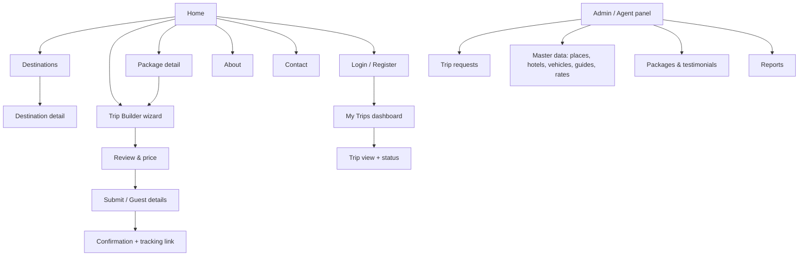

### 3.3 Page content

| Page | Sections |
|---|---|
| Home | Sticky navbar; hero with full-width Sri Lanka image/video, headline, "Start Planning" button and quick category chips; How it works (3 steps); Suggested trip packages (cards with days, tier badge, from-price, Book Now); Explore by category; Top destinations; Why choose us; Testimonials carousel; Travel stats counter; Newsletter; Footer; floating AI chat button |
| Destinations | Filter by category, district, province; card grid; map view toggle; search |
| Destination detail | Gallery, description, best time to visit, entry fee, opening hours, time needed, nearby places, nearby hotels, "Add to my trip" button, map pin |
| Trip Builder | 8-step wizard (Section 5) with live summary panel |
| Package detail | Day-by-day plan, map, inclusions/exclusions, tier options, Book Now and "Customize this trip" |
| About | Story, mission, team, licences (SLTDA registration), partner logos |
| Contact | Form (stored in DB + emailed), phone, WhatsApp, email, office map, FAQ |
| My Trips | List with status badges, view plan, download PDF, messages from agent |
| Admin panel | Dashboard counters, request queue, CRUD screens, price tables, reports |

### 3.4 Footer

Logo and short tagline; quick links (Home, Destinations, Plan a Trip, About, Contact); top categories; contact info with WhatsApp; social icons; newsletter field; copyright "© LankaGuide360" with Privacy Policy and Terms links.

## 4. Functional requirements

Every requirement below has an ID so it can be traced to a screen, a test case and a database table. Priority: M = must have for 1.0, S = should have, C = could have / later.

### 4.1 Category → district → place mapping (seed data)

Categories and districts are many-to-many: Kandy is both Historical and Hill Country, Galle is both Beach and Historical. The builder shows only districts linked to the categories the user picked, then only places in those districts that match those categories.

| Category | Districts shown | Example places |
|---|---|---|
| Beach & Coastal | Galle, Matara, Hambantota, Kalutara, Gampaha, Trincomalee, Batticaloa, Ampara, Puttalam | Unawatuna, Mirissa, Weligama, Bentota, Negombo, Nilaveli, Pasikudah, Arugam Bay, Kalpitiya |
| Historical & Cultural | Anuradhapura, Polonnaruwa, Matale, Kandy, Galle, Jaffna, Kurunegala | Sri Maha Bodhi, Gal Vihara, Sigiriya, Dambulla Cave Temple, Temple of the Tooth, Galle Fort, Nallur Kovil, Yapahuwa |
| Hill Country | Kandy, Nuwara Eliya, Badulla, Kegalle | Peradeniya Gardens, Gregory Lake, tea factories, Nine Arch Bridge, Lipton's Seat |
| Nature & Wildlife | Hambantota, Monaragala, Polonnaruwa, Ratnapura, Puttalam, Trincomalee | Yala, Bundala, Minneriya, Udawalawe, Sinharaja, Wilpattu, Pigeon Island |
| Hiking & Adventure | Badulla, Nuwara Eliya, Ratnapura, Kegalle, Matale, Kandy | Ella Rock, Little Adam's Peak, Horton Plains, Adam's Peak, Kitulgala rafting, Knuckles Range, Pidurangala |
| Hidden Gems (low tourist traffic) | Matale, Anuradhapura, Ampara, Mannar, Monaragala, Kurunegala, Badulla | Riverston, Ritigala, Gal Oya boat safari, Mannar baobab and Adam's Bridge view, Maligawila, Ridi Viharaya, Namunukula |

The Hidden Gems list is a starting set; the admin marks any place as a hidden gem with a flag and a crowd level (low/medium/high).

### 4.2 Requirements list

| ID | Requirement | Priority |
|---|---|---|
| FR-01 | The system shall show a Home page with hero, packages, categories, top destinations, testimonials and footer | M |
| FR-02 | The system shall list destinations filterable by category, district and province, with a map view | M |
| FR-03 | The builder shall let the user pick one travel tier: Budget, Premium or Luxury | M |
| FR-04 | The builder shall let the user pick one or more categories | M |
| FR-05 | The builder shall show only districts linked to the selected categories, grouped by province, on a clickable map and as cards | M |
| FR-06 | The builder shall show places per selected district with photo, time needed, entry fee and crowd level, and let the user tick them | M |
| FR-07 | The builder shall capture start date, number of days (1–21), arrival and departure point (default Bandaranaike International Airport) | M |
| FR-08 | The builder shall capture travellers: adults, children (with ages), infants | M |
| FR-09 | The system shall auto-arrange selected places into days by geography and drive time (Section 5.3) | M |
| FR-10 | The builder shall suggest hotels per overnight town matching the tier; filters: Luxury, Premium, Budget, Kid-friendly, pool, beach-front | M |
| FR-11 | The builder shall offer meal plans (Room only, Bed & Breakfast, Half Board, Full Board) and cuisine preferences (Sri Lankan, Western, Indian, Chinese, Vegetarian, Vegan, Halal, Seafood) | M |
| FR-12 | The system shall suggest a vehicle type from group size and luggage (Section 5.2), with child seats when children are under 4 | M |
| FR-13 | The system shall suggest a guide option: chauffeur-guide, national guide, or site guides only, filtered by language | S |
| FR-14 | The review page shall show a day-by-day timeline with arrival/departure times, drive time and distance between stops | M |
| FR-15 | The review page shall show a map with numbered markers and the road route for each day | M |
| FR-16 | The review page shall show a price breakdown: accommodation, transport, guide, meals, entry tickets, activities, service fee, taxes, total, and per person | M |
| FR-17 | Users shall be able to drag to reorder stops and move a stop to another day; times and prices recalculate | S |
| FR-18 | A registered user shall submit with one click; a guest shall submit after entering name, country, age, email, phone (with country code) and optional WhatsApp | M |
| FR-19 | The system shall email a confirmation with a reference number (e.g. LG360-2026-00042) and a private tracking link | M |
| FR-20 | Agents shall see a request queue, open a plan, edit it, set final price, approve or reject with a note | M |
| FR-21 | The system shall notify the traveller by email on every status change; the status shall show on My Trips | M |
| FR-22 | Agents and travellers shall exchange messages on the trip page | S |
| FR-23 | Home page packages shall open in the builder pre-filled, or go straight to Submit with "Book this package" | M |
| FR-24 | The AI chatbot shall answer travel questions and return clickable links to site pages and destinations | S |
| FR-25 | The traveller shall download the approved plan as PDF | S |
| FR-26 | Admins shall manage all master data and prices through CRUD screens | M |
| FR-27 | The system shall save a draft plan in the session (guest) or database (user) so a refresh loses nothing | M |
| FR-28 | Live trip tracking: with the traveller's consent, the driver's or traveller's phone location is shown to the agent during the trip | C |
| FR-29 | Contact form messages shall be stored and emailed to the admin | M |
| FR-30 | Users shall leave a review after trip completion; admin approves before it shows as a testimonial | S |

## 5. Trip builder design

The builder is an 8-step wizard where the tier is chosen first, because it sets sensible defaults for every later step; the user only changes what they care about.

### 5.1 Wizard steps (user-friendly flow)

1. **Travel style** — three large cards: Budget, Premium, Luxury, each with a one-line description and an indicative price per person per day.
2. **Interests** — multi-select chips with icons: Beach & Coastal, Historical & Cultural, Hill Country, Nature & Wildlife, Hiking & Adventure, Hidden Gems.
3. **Districts** — Sri Lanka map (SVG or Leaflet GeoJSON) with matching districts highlighted, plus cards grouped by province. Click to select.
4. **Places** — tabs per chosen district; place cards with photo, category badge, time needed, fee, crowd level, "Add" toggle. A counter shows "12 places ≈ 6 days recommended".
5. **Dates & travellers** — start date, number of days (pre-filled from the recommendation), adults, children with ages, arrival/departure airport.
6. **Stays & meals** — per overnight town, 3 hotel suggestions matching the tier (Kid-friendly filter when children are present); meal plan and cuisine chips; dietary notes field.
7. **Transport & guide** — the suggested vehicle is pre-selected from the group size; guide type and language.
8. **Review & submit** — day timeline, routed map, price breakdown, edit links back to each step, then Submit (login, register, or continue as guest).

A live summary panel (right sidebar on desktop, collapsible bottom sheet on mobile) always shows: tier, days used, places, travellers and the running total.

### 5.2 Luxury vs Premium vs Budget options

| Option | Budget | Premium | Luxury |
|---|---|---|---|
| Hotels | Guesthouses, homestays, 2-star | 3–4 star hotels, boutique villas | 5-star resorts, heritage bungalows, private villas |
| Room default | Standard double/twin | Deluxe with AC | Suite or sea/hill-view deluxe |
| Meal plan default | Bed & Breakfast | Half Board | Full Board or à la carte |
| Vehicle (1–3 pax) | Car (e.g. Toyota Axio) | Hybrid sedan / SUV | Luxury sedan or Land Cruiser |
| Vehicle (4–6 pax) | Standard van | Flat-roof KDH van | Premium van with extra legroom |
| Vehicle (7–9 pax) | High-roof van | High-roof KDH, reclining seats | Two premium vans or luxury mini coach |
| Vehicle (10+ pax) | Mini coach | Mini coach with AC | Luxury coach |
| Guide | Chauffeur-guide (driver speaks English) | Chauffeur-guide + site guides at major sites | SLTDA national guide + driver, choice of language |
| Transfers | Road only | Road + scenic train seat reservation (Kandy–Ella) | Road + first-class train or domestic air-taxi/seaplane option |
| Extras offered | Tuk-tuk city tours, public safari jeeps | Private safari jeep, cooking class | Private safari with naturalist, spa, private dining |
| Daily pacing default | 4–5 stops, longer drive days allowed | 3–4 stops | 2–3 stops, max about 4 h driving |

All rates live in admin-editable price tables; the tier only chooses which rate rows the builder defaults to.

### 5.3 Itinerary generation algorithm (rule-based)

Rule-based generation from your own database is fast and never invents places; the AI model is used only for the chatbot.

1. **Load** the selected places with latitude, longitude, visit duration, opening hours and district.
2. **Cluster** places by district, then order districts along a loop from the arrival airport using nearest-neighbour on district centroids (e.g. Negombo → Anuradhapura → Polonnaruwa → Matale → Kandy → Nuwara Eliya → Badulla → Hambantota → Matara → Galle → Colombo).
3. **Fill days**: walk the ordered places; add a place to the current day while (drive time + visit time) ≤ the tier's daily limit (Budget 10 h, Premium 9 h, Luxury 8 h) and the place is open at the arrival time. Otherwise start a new day.
4. **Choose an overnight town** for each day: the district town nearest the day's last stop that has hotels of the chosen tier.
5. **Time the day**: start 08:00 (07:30 for Budget); add drive minutes from the routing API; add visit minutes; insert a lunch break at 12:30–13:30; sunrise/sunset places (e.g. Sigiriya, Horton Plains) are pinned to their best time slot.
6. **Balance days**: if the user's day count is larger, insert rest/beach days at the longest-stay town; if smaller, drop the lowest-priority places and tell the user which ones.
7. **Cache** each leg's distance and duration in the `route_cache` table so repeat plans cost no API calls.

### 5.4 Pricing formula

```
Total = Σ(n=1..N) (room rate_n × rooms)
      + vehicle day rate × D + km rate × km
      + guide rate × D
      + meals × pax × D
      + Σ tickets + activities + service fee + tax
```

Where N = nights, D = days and pax = travellers. Rooms = ceil(adults ÷ 2), with extra beds for children. Entry tickets use the foreign-adult or foreign-child fee per place (children under a set age free). Service fee is a percentage per tier, set by the admin. The breakdown shows every line and a per-person figure, labelled "estimate — final price confirmed by your agent".

### 5.5 Vehicle and guide suggestion rules

| Travellers (incl. children) | Suggested vehicle | Guide rule |
|---|---|---|
| 1–3 | Car or SUV | Chauffeur-guide |
| 4–6 | Van | Chauffeur-guide; national guide offered for Luxury |
| 7–9 | High-roof van | Chauffeur-guide + optional site guides |
| 10–20 | Mini coach | Separate driver + national guide required |
| 21+ | Large coach | Driver + national guide + assistant |

Children under 4 add a child seat; more than 2 bags per person moves the group up one vehicle size.

## 6. System architecture

LankaGuide360 is a server-rendered Laravel MVC app: the browser gets Blade pages styled with Tailwind, small JSON endpoints feed the wizard and map, and all external APIs (routing, Hugging Face) are called only from the backend so keys never reach the browser.

```
Browser (visitor, agent, admin)
  Blade pages + Tailwind | Alpine.js wizard + chat | Leaflet map + routes
        │  HTTP pages + AJAX JSON
        ▼
Laravel 13 app on Apache (XAMPP)
  Routes + Middleware → Controllers → Blade views / JSON
                            │
                            ▼
  Eloquent Models ◄── Services (business logic)
                        ItineraryService, PricingService, SuggestionService,
                        RoutingService, ChatbotService
        │                   │                         │
        ▼                   ▼                         ▼
  MySQL / MariaDB     Routing API (ORS/Google)    Hugging Face API
                      (outside services, called only from the server so keys stay private)
```

All business rules (itinerary, pricing, suggestions) live in Services, so controllers stay thin and the same logic serves both pages and JSON endpoints.

### 6.1 How a request flows

1. Browser requests a page, e.g. `GET /destinations/kandy`.
2. Apache (XAMPP) passes it to `public/index.php`; Laravel's router matches `routes/web.php`.
3. Middleware runs: session, CSRF, auth, role check (`role:admin,agent` for the panel).
4. The Controller validates input with a Form Request, then calls a Service class (e.g. `ItineraryService`).
5. The Service reads/writes MySQL through Eloquent Models, and calls external APIs through `RoutingService` or `ChatbotService`, caching results.
6. The Controller returns a Blade view (full page) or JSON (for AJAX in the wizard, map and chatbot).
7. Vite-built Tailwind CSS and Alpine.js/Leaflet JavaScript render and add interactivity.

### 6.2 Laravel folder structure

```
lankaguide360/
├── app/
│   ├── Http/
│   │   ├── Controllers/
│   │   │   ├── HomeController.php
│   │   │   ├── DestinationController.php
│   │   │   ├── TripBuilderController.php   # wizard steps + JSON endpoints
│   │   │   ├── TripController.php          # submit, view, PDF, messages
│   │   │   ├── ChatbotController.php
│   │   │   ├── ContactController.php
│   │   │   └── Admin/                      # Dashboard, TripRequest, Place, Hotel, Vehicle, Guide, Package, Rate, User
│   │   ├── Middleware/RoleMiddleware.php
│   │   └── Requests/                       # StoreTripRequest, GuestDetailsRequest ...
│   ├── Models/                             # User, Category, Province, District, Place, Hotel, RoomRate,
│   │                                       # Vehicle, Guide, MealPlan, Cuisine, Trip, TripDay, TripStop,
│   │                                       # TripHotel, TripTraveller, Package, Review, Message, RouteCache
│   ├── Services/
│   │   ├── ItineraryService.php            # clustering, day filling, timing (Section 5.3)
│   │   ├── PricingService.php              # price breakdown (Section 5.4)
│   │   ├── SuggestionService.php           # vehicle, guide, hotel suggestions
│   │   ├── RoutingService.php              # OpenRouteService / Google Directions + cache
│   │   └── ChatbotService.php              # Hugging Face calls + site knowledge
│   ├── Mail/                               # TripSubmitted, TripApproved, TripRejected
│   └── Notifications/
├── database/
│   ├── migrations/
│   └── seeders/                            # provinces, 25 districts, categories, places, hotels, vehicles
├── resources/
│   ├── views/
│   │   ├── layouts/app.blade.php  admin.blade.php
│   │   ├── components/                     # navbar, footer, place-card, package-card, stepper, chat-widget
│   │   ├── home.blade.php  about.blade.php  contact.blade.php
│   │   ├── destinations/  index, show
│   │   ├── builder/  step1..step8, review
│   │   ├── trips/  show, pdf, my-trips
│   │   └── admin/ ...
│   ├── css/app.css                         # @import "tailwindcss"
│   └── js/  app.js  builder.js  map.js  chatbot.js
├── routes/  web.php  api.php
├── public/  images/  storage -> ../storage/app/public
└── .env
```

### 6.3 Key routes

| Method | URL | Controller@method | Returns |
|---|---|---|---|
| GET | `/` | HomeController@index | Home page |
| GET | `/destinations`, `/destinations/{slug}` | DestinationController@index, @show | Pages |
| GET | `/plan` | TripBuilderController@start | Wizard |
| GET | `/api/builder/districts?categories=1,3` | TripBuilderController@districts | JSON districts |
| GET | `/api/builder/places?districts=5,8&categories=1` | TripBuilderController@places | JSON places |
| POST | `/api/builder/generate` | TripBuilderController@generate | JSON days, stops, times, route geometry |
| POST | `/api/builder/price` | TripBuilderController@price | JSON breakdown |
| GET | `/api/builder/hotels?town=..&tier=..&kids=1` | TripBuilderController@hotels | JSON hotels |
| POST | `/trips` | TripController@store | Redirect to confirmation |
| GET | `/trips/{reference}?token=..` | TripController@show | Trip page (guest via signed link) |
| POST | `/api/chat` | ChatbotController@send | JSON reply + links |
| GET/POST | `/admin/trips/{id}/approve`, `/reject` | Admin\TripRequestController | Redirect |

### 6.4 External services

| Need | Recommended | Notes |
|---|---|---|
| Map tiles | Leaflet + OpenStreetMap tiles | Show OSM attribution; for heavy traffic use a tile provider |
| Road routing and drive times | OpenRouteService (free API key) or Google Directions API | Call from backend, cache in `route_cache`. Avoid the public OSRM demo server for production |
| Geocoding | Store coordinates in the `places` table | No runtime geocoding needed |
| Chatbot | Hugging Face Inference Providers | Server-side token in `.env` |
| Email | SMTP (Mailtrap locally, Gmail/SES live) | Queue mails with `database` queue driver |
| PDF | barryvdh/laravel-dompdf | Approved plan download |

The OSRM demo server offers no guarantees, forbids excessive use and can be withdrawn at any time (OSRM API usage policy), and Leaflet Routing Machine no longer works out of the box because its default demo backend is unmaintained. That is why routing goes through your own backend with a keyed provider and a cache.

### 6.5 AI chatbot design

The chatbot calls Hugging Face's OpenAI-compatible endpoint `https://router.huggingface.co/v1/chat/completions` with a fine-grained token that has the "Make calls to Inference Providers" permission; Inference Providers include a free tier.

1. The widget (Alpine.js) posts the message and the last 6 turns to `/api/chat`.
2. `ChatbotService` builds a system prompt: "You are LankaGuide360's travel assistant for Sri Lanka…" plus a short site map with URLs, and the top matching places/packages from MySQL (simple keyword search with `FULLTEXT` index — a lightweight retrieval step so answers use your real data).
3. It asks the model to answer and, when relevant, return links in the form `[Plan a trip](/plan)`.
4. The reply is sanitized, links are rendered as buttons ("Open Trip Builder", "See Kandy").
5. Rate limit: 20 messages per 10 minutes per IP (`throttle` middleware). Log conversations in `chat_logs` for improvement.
6. Fallback: if the API fails, answer from an FAQ table using keyword match.

Choose a small instruct model (e.g. a Qwen or Llama 8B-class instruct model) for low cost and speed; the model id is a `.env` setting so it can be changed without code changes.

## 7. Database design

The database has 29 tables in three groups: master data the admin manages (places, hotels, vehicles, rates), trip data each user creates (trip, days, stops, travellers, price lines), and support tables (messages, reviews, route cache, chat logs). In Laravel you create them with migrations (`php artisan migrate`); the SQL below shows the resulting structure.

### 7.1 ER diagram

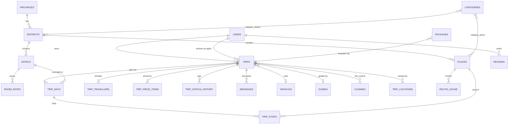

### 7.2 Table summary

| Table | Purpose | Key columns |
|---|---|---|
| users | Travellers, agents, admins | role (traveller/agent/admin), country, phone, age |
| provinces, districts | 9 provinces, 25 districts | district lat/lng, slug, image |
| categories | 6 interest categories | slug, icon |
| category_district, category_place | Many-to-many links | composite primary key |
| places | Attractions | lat, lng, visit_minutes, opening hours, fees, crowd_level, is_hidden_gem |
| place_images | Gallery | path, sort_order |
| hotels | Stays | town, tier, star_rating, kid_friendly, amenities (JSON) |
| room_rates | Seasonal prices | room_type, meal_plan, price, season dates |
| vehicles | Fleet types | tier, min_pax, max_pax, day_rate, km_rate |
| guides | Guides | type, languages (JSON), day_rate |
| cuisines, trip_cuisine | Cuisine choices | name |
| trips | One trip plan | reference, tier, status, totals, access_token |
| trip_days | One row per day | date, overnight hotel, drive totals |
| trip_stops | Ordered stops in a day | sequence, arrive_at, depart_at, leg km/min |
| trip_travellers | Lead guest + companions | name, country, age, email, phone |
| trip_price_items | Price breakdown lines | category, qty, unit_price, amount |
| trip_status_history | Audit trail | from/to status, changed_by, note |
| messages | Agent–traveller chat | sender, body, read_at |
| packages | Home page trip cards | tier, days, from_price, template_trip_id |
| reviews | Testimonials | rating, comment, is_approved |
| contact_messages | Contact form | name, email, subject, body |
| route_cache | Cached drive legs | from/to place, km, minutes, geometry |
| chat_logs | Chatbot history | session_id, role, message |
| trip_locations | Future live tracking | lat, lng, recorded_at |
| settings | Service fee %, tax %, currency rate | key, value |

### 7.3 Core SQL (MySQL / MariaDB)

```sql
CREATE DATABASE lankaguide360 CHARACTER SET utf8mb4 COLLATE utf8mb4_unicode_ci;
USE lankaguide360;

CREATE TABLE users (
  id BIGINT UNSIGNED AUTO_INCREMENT PRIMARY KEY,
  name VARCHAR(120) NOT NULL,
  email VARCHAR(190) NOT NULL UNIQUE,
  password VARCHAR(255) NOT NULL,
  role ENUM('traveller','agent','admin') NOT NULL DEFAULT 'traveller',
  phone VARCHAR(30), country VARCHAR(80), age TINYINT UNSIGNED,
  email_verified_at TIMESTAMP NULL, remember_token VARCHAR(100),
  created_at TIMESTAMP NULL, updated_at TIMESTAMP NULL
);

CREATE TABLE provinces (id SMALLINT UNSIGNED AUTO_INCREMENT PRIMARY KEY, name VARCHAR(60) NOT NULL);

CREATE TABLE districts (
  id SMALLINT UNSIGNED AUTO_INCREMENT PRIMARY KEY,
  province_id SMALLINT UNSIGNED NOT NULL,
  name VARCHAR(60) NOT NULL, slug VARCHAR(80) NOT NULL UNIQUE,
  lat DECIMAL(9,6), lng DECIMAL(9,6), description TEXT, image VARCHAR(255),
  FOREIGN KEY (province_id) REFERENCES provinces(id)
);

CREATE TABLE categories (
  id SMALLINT UNSIGNED AUTO_INCREMENT PRIMARY KEY,
  name VARCHAR(60) NOT NULL, slug VARCHAR(80) NOT NULL UNIQUE, icon VARCHAR(60)
);

CREATE TABLE category_district (
  category_id SMALLINT UNSIGNED, district_id SMALLINT UNSIGNED,
  PRIMARY KEY (category_id, district_id),
  FOREIGN KEY (category_id) REFERENCES categories(id) ON DELETE CASCADE,
  FOREIGN KEY (district_id) REFERENCES districts(id) ON DELETE CASCADE
);

CREATE TABLE places (
  id INT UNSIGNED AUTO_INCREMENT PRIMARY KEY,
  district_id SMALLINT UNSIGNED NOT NULL,
  name VARCHAR(150) NOT NULL, slug VARCHAR(170) NOT NULL UNIQUE,
  short_description VARCHAR(300), description TEXT,
  lat DECIMAL(9,6) NOT NULL, lng DECIMAL(9,6) NOT NULL,
  visit_minutes SMALLINT UNSIGNED DEFAULT 90,
  open_time TIME NULL, close_time TIME NULL,
  best_time_slot ENUM('any','sunrise','morning','afternoon','sunset') DEFAULT 'any',
  fee_foreign_adult DECIMAL(10,2) DEFAULT 0, fee_foreign_child DECIMAL(10,2) DEFAULT 0,
  crowd_level ENUM('low','medium','high') DEFAULT 'medium',
  is_hidden_gem BOOLEAN DEFAULT 0, best_months VARCHAR(40), cover_image VARCHAR(255),
  is_active BOOLEAN DEFAULT 1, created_at TIMESTAMP NULL, updated_at TIMESTAMP NULL,
  FOREIGN KEY (district_id) REFERENCES districts(id),
  INDEX (district_id), FULLTEXT (name, short_description)
);

CREATE TABLE category_place (
  category_id SMALLINT UNSIGNED, place_id INT UNSIGNED,
  PRIMARY KEY (category_id, place_id),
  FOREIGN KEY (category_id) REFERENCES categories(id) ON DELETE CASCADE,
  FOREIGN KEY (place_id) REFERENCES places(id) ON DELETE CASCADE
);

CREATE TABLE hotels (
  id INT UNSIGNED AUTO_INCREMENT PRIMARY KEY,
  district_id SMALLINT UNSIGNED NOT NULL, town VARCHAR(80) NOT NULL,
  name VARCHAR(150) NOT NULL, tier ENUM('budget','premium','luxury') NOT NULL,
  star_rating TINYINT UNSIGNED, kid_friendly BOOLEAN DEFAULT 0,
  lat DECIMAL(9,6), lng DECIMAL(9,6), amenities JSON, cover_image VARCHAR(255),
  is_active BOOLEAN DEFAULT 1,
  FOREIGN KEY (district_id) REFERENCES districts(id), INDEX (town, tier)
);

CREATE TABLE room_rates (
  id INT UNSIGNED AUTO_INCREMENT PRIMARY KEY, hotel_id INT UNSIGNED NOT NULL,
  room_type VARCHAR(60) NOT NULL,
  meal_plan ENUM('RO','BB','HB','FB','AI') NOT NULL DEFAULT 'BB',
  price_per_night DECIMAL(10,2) NOT NULL, max_occupancy TINYINT UNSIGNED DEFAULT 2,
  extra_bed_price DECIMAL(10,2) DEFAULT 0, season_from DATE NULL, season_to DATE NULL,
  FOREIGN KEY (hotel_id) REFERENCES hotels(id) ON DELETE CASCADE
);

CREATE TABLE vehicles (
  id SMALLINT UNSIGNED AUTO_INCREMENT PRIMARY KEY,
  type VARCHAR(60) NOT NULL, example_model VARCHAR(80),
  tier ENUM('budget','premium','luxury') NOT NULL,
  min_pax TINYINT UNSIGNED NOT NULL, max_pax TINYINT UNSIGNED NOT NULL,
  luggage_capacity TINYINT UNSIGNED, day_rate DECIMAL(10,2) NOT NULL, km_rate DECIMAL(8,2) DEFAULT 0,
  image VARCHAR(255)
);

CREATE TABLE guides (
  id SMALLINT UNSIGNED AUTO_INCREMENT PRIMARY KEY,
  name VARCHAR(120) NOT NULL, type ENUM('chauffeur','national','site') NOT NULL,
  languages JSON, day_rate DECIMAL(10,2) NOT NULL, phone VARCHAR(30), is_available BOOLEAN DEFAULT 1
);

CREATE TABLE cuisines (id SMALLINT UNSIGNED AUTO_INCREMENT PRIMARY KEY, name VARCHAR(60) NOT NULL);

CREATE TABLE trips (
  id BIGINT UNSIGNED AUTO_INCREMENT PRIMARY KEY,
  reference VARCHAR(20) NOT NULL UNIQUE,              -- LG360-2026-00042
  user_id BIGINT UNSIGNED NULL, agent_id BIGINT UNSIGNED NULL,
  tier ENUM('budget','premium','luxury') NOT NULL,
  start_date DATE NOT NULL, days TINYINT UNSIGNED NOT NULL,
  adults TINYINT UNSIGNED NOT NULL DEFAULT 1, children TINYINT UNSIGNED DEFAULT 0, infants TINYINT UNSIGNED DEFAULT 0,
  children_ages VARCHAR(40), arrival_point VARCHAR(80) DEFAULT 'BIA Katunayake', departure_point VARCHAR(80) DEFAULT 'BIA Katunayake',
  meal_plan ENUM('RO','BB','HB','FB','AI') DEFAULT 'BB',
  vehicle_id SMALLINT UNSIGNED NULL, guide_type ENUM('chauffeur','national','site','none') DEFAULT 'chauffeur',
  guide_id SMALLINT UNSIGNED NULL, guide_language VARCHAR(30) DEFAULT 'English',
  special_requests TEXT,
  status ENUM('draft','submitted','under_review','approved','rejected','confirmed','in_progress','completed','cancelled') NOT NULL DEFAULT 'draft',
  estimated_total DECIMAL(12,2), final_total DECIMAL(12,2), currency CHAR(3) DEFAULT 'USD',
  access_token CHAR(40) NOT NULL,                     -- guest view link
  tracking_consent BOOLEAN DEFAULT 0,
  submitted_at TIMESTAMP NULL, approved_at TIMESTAMP NULL,
  created_at TIMESTAMP NULL, updated_at TIMESTAMP NULL,
  FOREIGN KEY (user_id) REFERENCES users(id) ON DELETE SET NULL,
  FOREIGN KEY (agent_id) REFERENCES users(id) ON DELETE SET NULL,
  FOREIGN KEY (vehicle_id) REFERENCES vehicles(id), FOREIGN KEY (guide_id) REFERENCES guides(id),
  INDEX (status), INDEX (user_id)
);

CREATE TABLE trip_category (trip_id BIGINT UNSIGNED, category_id SMALLINT UNSIGNED, PRIMARY KEY (trip_id, category_id),
  FOREIGN KEY (trip_id) REFERENCES trips(id) ON DELETE CASCADE, FOREIGN KEY (category_id) REFERENCES categories(id));
CREATE TABLE trip_cuisine (trip_id BIGINT UNSIGNED, cuisine_id SMALLINT UNSIGNED, PRIMARY KEY (trip_id, cuisine_id),
  FOREIGN KEY (trip_id) REFERENCES trips(id) ON DELETE CASCADE, FOREIGN KEY (cuisine_id) REFERENCES cuisines(id));

CREATE TABLE trip_days (
  id BIGINT UNSIGNED AUTO_INCREMENT PRIMARY KEY, trip_id BIGINT UNSIGNED NOT NULL,
  day_number TINYINT UNSIGNED NOT NULL, date DATE NOT NULL, title VARCHAR(150),
  overnight_town VARCHAR(80), hotel_id INT UNSIGNED NULL, room_rate_id INT UNSIGNED NULL, rooms TINYINT UNSIGNED DEFAULT 1,
  drive_km DECIMAL(7,1) DEFAULT 0, drive_minutes SMALLINT UNSIGNED DEFAULT 0,
  UNIQUE (trip_id, day_number),
  FOREIGN KEY (trip_id) REFERENCES trips(id) ON DELETE CASCADE,
  FOREIGN KEY (hotel_id) REFERENCES hotels(id), FOREIGN KEY (room_rate_id) REFERENCES room_rates(id)
);

CREATE TABLE trip_stops (
  id BIGINT UNSIGNED AUTO_INCREMENT PRIMARY KEY, trip_day_id BIGINT UNSIGNED NOT NULL,
  place_id INT UNSIGNED NOT NULL, sequence TINYINT UNSIGNED NOT NULL,
  arrive_at TIME, depart_at TIME, km_from_prev DECIMAL(7,1), minutes_from_prev SMALLINT UNSIGNED,
  FOREIGN KEY (trip_day_id) REFERENCES trip_days(id) ON DELETE CASCADE,
  FOREIGN KEY (place_id) REFERENCES places(id)
);

CREATE TABLE trip_travellers (
  id BIGINT UNSIGNED AUTO_INCREMENT PRIMARY KEY, trip_id BIGINT UNSIGNED NOT NULL,
  full_name VARCHAR(120) NOT NULL, country VARCHAR(80), age TINYINT UNSIGNED,
  email VARCHAR(190), phone VARCHAR(30), whatsapp VARCHAR(30), passport_no VARCHAR(30),
  is_lead BOOLEAN DEFAULT 0,
  FOREIGN KEY (trip_id) REFERENCES trips(id) ON DELETE CASCADE
);

CREATE TABLE trip_price_items (
  id BIGINT UNSIGNED AUTO_INCREMENT PRIMARY KEY, trip_id BIGINT UNSIGNED NOT NULL,
  category ENUM('accommodation','transport','guide','meals','tickets','activities','service_fee','tax','discount') NOT NULL,
  description VARCHAR(200), qty DECIMAL(8,2) DEFAULT 1, unit_price DECIMAL(10,2), amount DECIMAL(12,2) NOT NULL,
  FOREIGN KEY (trip_id) REFERENCES trips(id) ON DELETE CASCADE
);

CREATE TABLE trip_status_history (
  id BIGINT UNSIGNED AUTO_INCREMENT PRIMARY KEY, trip_id BIGINT UNSIGNED NOT NULL,
  from_status VARCHAR(20), to_status VARCHAR(20) NOT NULL, changed_by BIGINT UNSIGNED NULL,
  note TEXT, created_at TIMESTAMP NULL,
  FOREIGN KEY (trip_id) REFERENCES trips(id) ON DELETE CASCADE
);

CREATE TABLE messages (
  id BIGINT UNSIGNED AUTO_INCREMENT PRIMARY KEY, trip_id BIGINT UNSIGNED NOT NULL,
  sender_id BIGINT UNSIGNED NULL, sender_role ENUM('traveller','agent','system') NOT NULL,
  body TEXT NOT NULL, read_at TIMESTAMP NULL, created_at TIMESTAMP NULL,
  FOREIGN KEY (trip_id) REFERENCES trips(id) ON DELETE CASCADE
);

CREATE TABLE packages (
  id INT UNSIGNED AUTO_INCREMENT PRIMARY KEY, template_trip_id BIGINT UNSIGNED NOT NULL,
  name VARCHAR(150) NOT NULL, slug VARCHAR(170) UNIQUE, tier ENUM('budget','premium','luxury'),
  days TINYINT UNSIGNED, from_price DECIMAL(10,2), cover_image VARCHAR(255), summary VARCHAR(300),
  inclusions TEXT, exclusions TEXT, is_featured BOOLEAN DEFAULT 0, sort_order SMALLINT DEFAULT 0,
  FOREIGN KEY (template_trip_id) REFERENCES trips(id)
);

CREATE TABLE reviews (
  id INT UNSIGNED AUTO_INCREMENT PRIMARY KEY, user_id BIGINT UNSIGNED NULL, trip_id BIGINT UNSIGNED NULL,
  author_name VARCHAR(120), country VARCHAR(80), rating TINYINT UNSIGNED NOT NULL, comment TEXT,
  is_approved BOOLEAN DEFAULT 0, created_at TIMESTAMP NULL
);

CREATE TABLE route_cache (
  id BIGINT UNSIGNED AUTO_INCREMENT PRIMARY KEY,
  from_lat DECIMAL(9,6), from_lng DECIMAL(9,6), to_lat DECIMAL(9,6), to_lng DECIMAL(9,6),
  km DECIMAL(7,1), minutes SMALLINT UNSIGNED, geometry MEDIUMTEXT, provider VARCHAR(30), updated_at TIMESTAMP NULL,
  UNIQUE KEY leg (from_lat, from_lng, to_lat, to_lng)
);

CREATE TABLE trip_locations (                          -- future live tracking
  id BIGINT UNSIGNED AUTO_INCREMENT PRIMARY KEY, trip_id BIGINT UNSIGNED NOT NULL,
  lat DECIMAL(9,6), lng DECIMAL(9,6), accuracy_m SMALLINT, source ENUM('traveller','driver'), recorded_at TIMESTAMP,
  FOREIGN KEY (trip_id) REFERENCES trips(id) ON DELETE CASCADE, INDEX (trip_id, recorded_at)
);

CREATE TABLE contact_messages (id INT UNSIGNED AUTO_INCREMENT PRIMARY KEY, name VARCHAR(120), email VARCHAR(190), phone VARCHAR(30),
  subject VARCHAR(150), body TEXT, is_read BOOLEAN DEFAULT 0, created_at TIMESTAMP NULL);
CREATE TABLE chat_logs (id BIGINT UNSIGNED AUTO_INCREMENT PRIMARY KEY, session_id VARCHAR(64), user_id BIGINT UNSIGNED NULL,
  role ENUM('user','assistant'), message TEXT, created_at TIMESTAMP NULL, INDEX (session_id));
CREATE TABLE settings (`key` VARCHAR(60) PRIMARY KEY, `value` VARCHAR(255));
```

### 7.4 Same table as a Laravel migration (example)

```php
// database/migrations/2026_10_01_000010_create_places_table.php
Schema::create('places', function (Blueprint $table) {
    $table->id();
    $table->foreignId('district_id')->constrained();
    $table->string('name', 150);
    $table->string('slug', 170)->unique();
    $table->string('short_description', 300)->nullable();
    $table->text('description')->nullable();
    $table->decimal('lat', 9, 6);
    $table->decimal('lng', 9, 6);
    $table->unsignedSmallInteger('visit_minutes')->default(90);
    $table->time('open_time')->nullable();
    $table->time('close_time')->nullable();
    $table->enum('best_time_slot', ['any','sunrise','morning','afternoon','sunset'])->default('any');
    $table->decimal('fee_foreign_adult', 10, 2)->default(0);
    $table->decimal('fee_foreign_child', 10, 2)->default(0);
    $table->enum('crowd_level', ['low','medium','high'])->default('medium');
    $table->boolean('is_hidden_gem')->default(false);
    $table->string('cover_image')->nullable();
    $table->boolean('is_active')->default(true);
    $table->timestamps();
    $table->fullText(['name', 'short_description']);
});
```

Write one migration per table in dependency order (provinces → districts → categories → places → hotels → … → trips → trip_days → trip_stops), and a seeder per master table so `php artisan migrate:fresh --seed` rebuilds everything.

## 8. Sequence and workflow diagrams

Each main task has one diagram below; together they cover a trip's whole life from the first click to approval.

### 8.1 Workflow: end-to-end trip journey

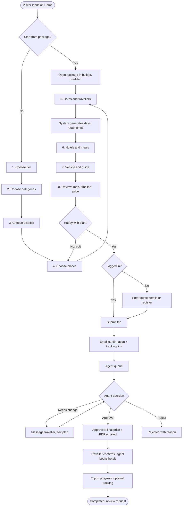

### 8.2 Sequence: building and generating a trip

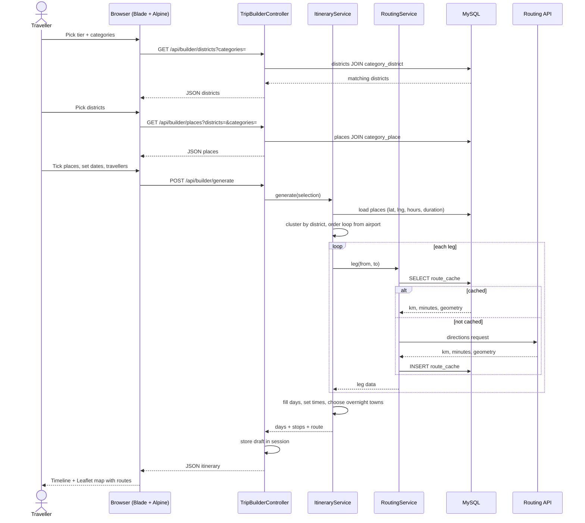

### 8.3 Sequence: hotels, meals, vehicle and price

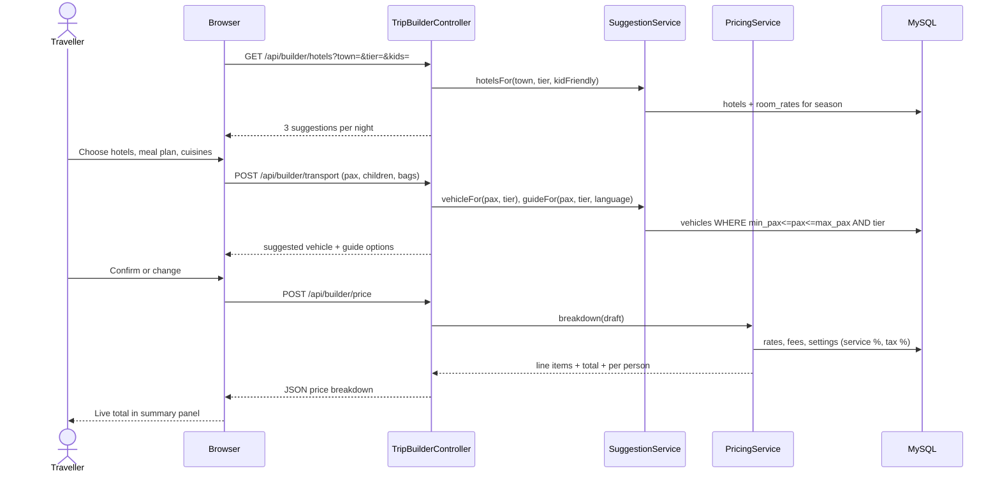

### 8.4 Sequence: submitting a trip (registered or guest)

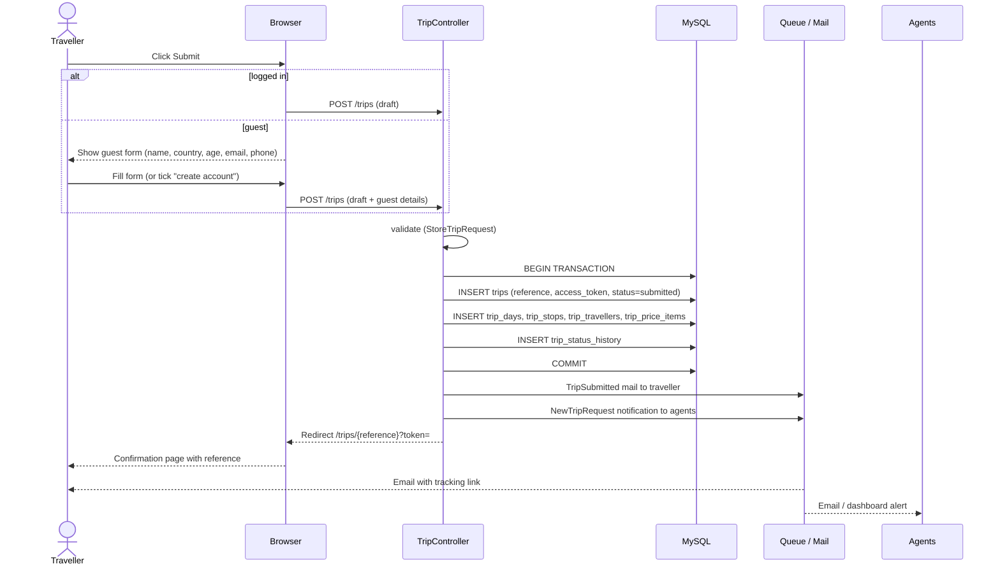

### 8.5 Sequence: agent review and approval

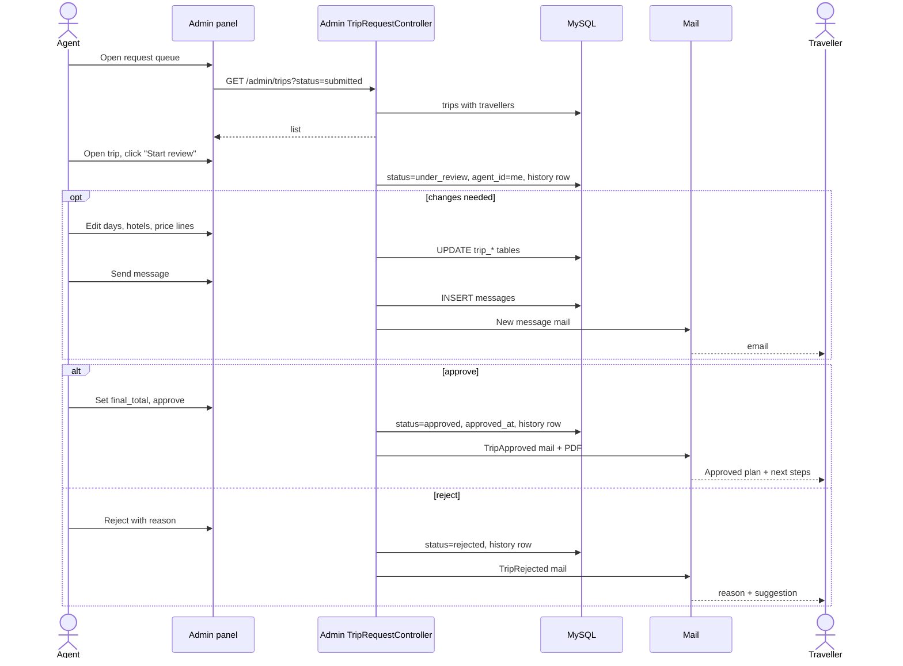

### 8.6 Sequence: AI chatbot

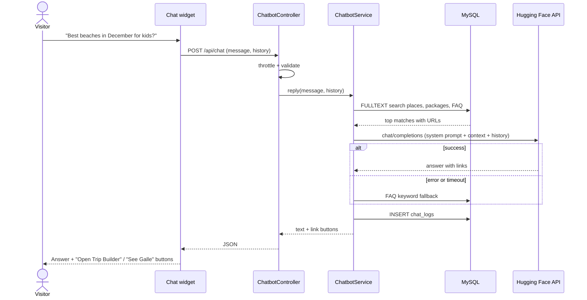

### 8.7 Sequence: booking a Home page package

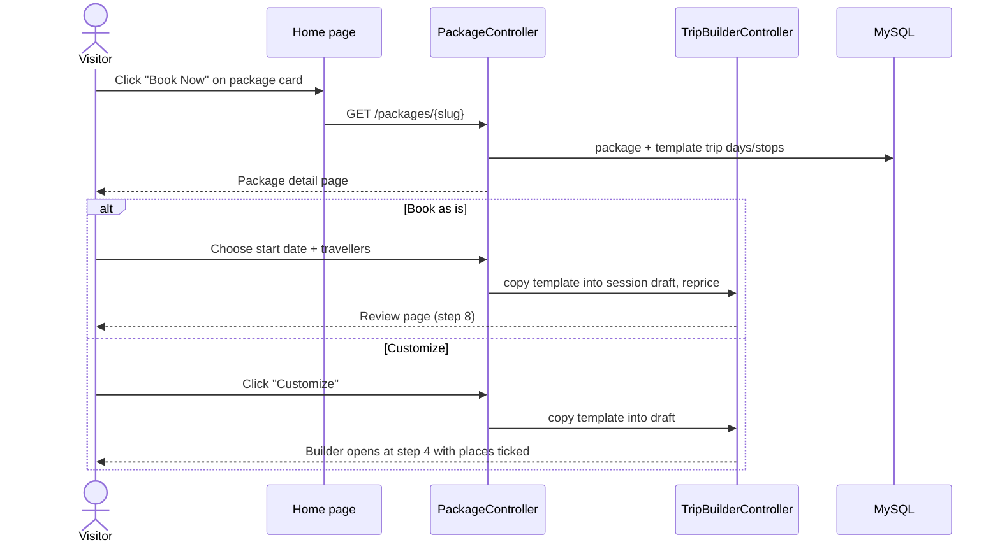

### 8.8 Trip status workflow

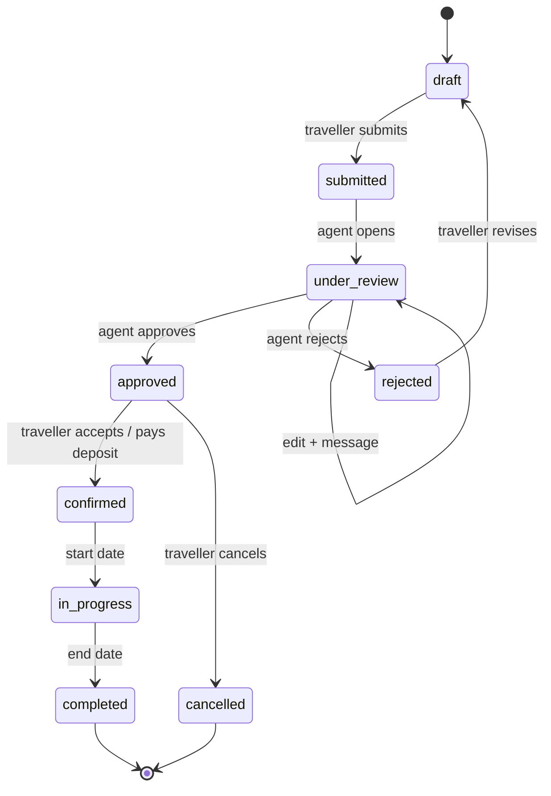

### 8.9 Sequence: live tracking (future phase)

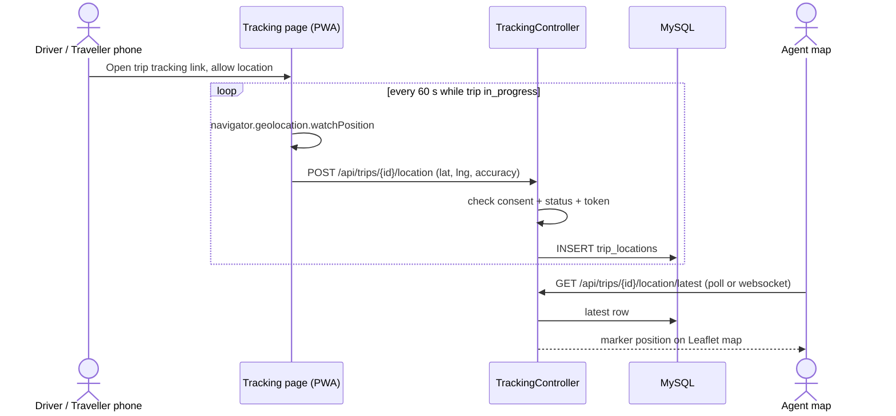

## 9. Non-functional requirements

The site must load fast on Sri Lankan and overseas mobile networks, keep personal data safe, and work on any screen from 360 px phones to desktops.

| ID | Area | Requirement | How to achieve it |
|---|---|---|---|
| NFR-01 | Performance | Pages reach Largest Contentful Paint under 2.5 s on 4G | Vite production build, Tailwind purge (only used classes), WebP images with `loading="lazy"`, `srcset` sizes |
| NFR-02 | Performance | Itinerary generation returns in under 2 s for up to 25 places | Route cache table, eager loading (`with()`), indexes on foreign keys |
| NFR-03 | Performance | Server-side caching | `php artisan config:cache route:cache view:cache`; cache category/district lists for 1 h |
| NFR-04 | Responsiveness | Mobile-first layouts at Tailwind breakpoints sm/md/lg/xl | Wizard becomes full-screen steps with a bottom summary sheet on phones |
| NFR-05 | Security | Passwords hashed with bcrypt; CSRF on every form; Eloquent parameter binding against SQL injection; Blade escaping against XSS | Laravel defaults, never use raw `{!! !!}` for user text |
| NFR-06 | Security | Guest trips viewable only with a 40-character random token or a signed URL | `Str::random(40)`, `URL::signedRoute()` |
| NFR-07 | Security | Role-based access for agent/admin routes | `RoleMiddleware`, policies per model |
| NFR-08 | Security | API keys (routing, Hugging Face, mail) only in `.env`, never in JavaScript | Backend proxies all calls |
| NFR-09 | Security | Rate limits on chat (20/10 min), contact form and login | `throttle` middleware |
| NFR-10 | Privacy | Consent checkbox for storing personal data; location tracking only with explicit opt-in, only during the trip, deletable | `tracking_consent` flag, purge job 30 days after trip end |
| NFR-11 | Usability | Every wizard step has Back, keeps choices, and shows errors next to the field | Session draft + inline validation |
| NFR-12 | Accessibility | WCAG 2.1 AA: alt text, labels, keyboard navigation, 4.5:1 contrast | Tailwind focus rings, semantic HTML |
| NFR-13 | SEO | Clean URLs (`/destinations/kandy/temple-of-the-tooth`), meta titles, Open Graph, sitemap.xml, schema.org TouristAttraction markup | Blade `@section('meta')`, spatie/laravel-sitemap |
| NFR-14 | Reliability | Chatbot and routing degrade gracefully if external APIs fail | FAQ fallback; straight-line distance × 1.4 as a routing fallback estimate |
| NFR-15 | Maintainability | PSR-12 code style, Services for business logic, Feature tests for builder and submission | Laravel Pint, PHPUnit/Pest |
| NFR-16 | Currency & locale | Prices in USD with optional LKR/EUR display; dates in the traveller's format | `settings` table exchange rates |
| NFR-17 | Browser support | Latest 2 versions of Chrome, Safari, Firefox, Edge; Android and iOS | — |

## 10. Running on localhost (XAMPP)

You need XAMPP (Apache + MariaDB), PHP 8.3+, Composer and Node.js; after the steps below the site runs at `http://127.0.0.1:8000` or `http://lankaguide360.test`.

### 10.1 Install the tools

1. Install **XAMPP** for Windows and start **Apache** and **MySQL** from the XAMPP Control Panel.
2. Check PHP: open a terminal and run `php -v`. If it shows 8.2.x, either upgrade XAMPP's PHP to 8.3/8.4 (step 3) or use Laravel 12 instead of 13.
3. Upgrade XAMPP PHP (optional): stop Apache, back up `C:\xampp\php`, download the **Thread Safe** x64 ZIP of PHP 8.3/8.4 from windows.php.net, extract it to `C:\xampp\php`, create `php.ini` from `php.ini-development`, then restart Apache. The Apache module DLL name must match the new version in `C:\xampp\apache\conf\extra\httpd-xampp.conf`.
4. In `php.ini` enable these extensions: `curl`, `fileinfo`, `gd`, `intl`, `mbstring`, `openssl`, `pdo_mysql`, `zip`. Add `C:\xampp\php` to the Windows PATH.
5. Install **Composer** and **Node.js LTS**. Check with `composer -V` and `node -v`.

> Done for this machine on 2026-09-29: PHP 8.4.26 TS x64 in `C:\xampp\php` (old 8.2 kept in
> `C:\xampp\php82-backup`), ICU DLLs added as `LoadFile` lines in `httpd-xampp.conf` so `intl`
> loads under Apache (backup: `httpd-xampp.conf.bak-php82`), Composer in `C:\xampp\php\composer.bat`.

### 10.2 Create the project

```sh
composer create-project laravel/laravel lankaguide360
composer require laravel/breeze --dev
php artisan breeze:install blade
composer require barryvdh/laravel-dompdf spatie/laravel-sitemap
npm install
npm install flowbite leaflet alpinejs
```

If Breeze is not offered for your Laravel version, use `laravel new lankaguide360` and pick the Livewire starter kit instead.

### 10.3 Create the database and configure .env

1. Create the database with collation `utf8mb4_unicode_ci` (this project: `lankaguide360_app`).
2. Edit `.env`:

```ini
APP_NAME=LankaGuide360
APP_URL=http://127.0.0.1:8000

DB_CONNECTION=mysql
DB_HOST=127.0.0.1
DB_PORT=3306
DB_DATABASE=lankaguide360_app
DB_USERNAME=root
DB_PASSWORD=

QUEUE_CONNECTION=database
MAIL_MAILER=smtp
MAIL_HOST=sandbox.smtp.mailtrap.io
MAIL_PORT=2525
MAIL_USERNAME=your_mailtrap_user
MAIL_PASSWORD=your_mailtrap_pass

HF_TOKEN=hf_xxxxxxxxxxxxxxxxx
HF_MODEL=Qwen/Qwen3-8B
ROUTING_PROVIDER=openrouteservice
ORS_API_KEY=your_ors_key
```

3. Run migrations and seeders, and link storage for uploaded images:

```sh
php artisan key:generate
php artisan migrate --seed
php artisan storage:link
```

### 10.4 Run the site

Open three terminals in the project folder:

```sh
npm run dev            # Vite: compiles Tailwind + JS, hot reload
php artisan serve      # http://127.0.0.1:8000
php artisan queue:work # sends emails in the background
```

Default logins from the seeder: `admin@lankaguide360.test` and `agent@lankaguide360.test` with password `password` (change before going live).

### 10.5 Optional: pretty local URL through Apache

1. In `C:\xampp\apache\conf\extra\httpd-vhosts.conf` add:

```apache
<VirtualHost *:80>
    ServerName lankaguide360.test
    DocumentRoot "E:/Projects/Tourism Application/tripplanner/public"
    <Directory "E:/Projects/Tourism Application/tripplanner/public">
        AllowOverride All
        Require all granted
    </Directory>
</VirtualHost>
```

2. Add `127.0.0.1 lankaguide360.test` to `C:\Windows\System32\drivers\etc\hosts` (run Notepad as administrator).
3. Make sure `mod_rewrite` is enabled in `httpd.conf`, restart Apache, set `APP_URL=http://lankaguide360.test`, run `npm run build`.

### 10.6 Tailwind setup check

`resources/css/app.css` starts with `@import "tailwindcss";` and the layout loads assets with `@vite(['resources/css/app.css', 'resources/js/app.js'])`. For Flowbite: `@import "flowbite/src/themes/default";`, `@plugin "flowbite/plugin";` and `@source "../../node_modules/flowbite";` in app.css, then `import 'flowbite';` in app.js.

### 10.7 Common problems

| Problem | Fix |
|---|---|
| `could not find driver` | Enable `extension=pdo_mysql` in php.ini, restart terminal |
| Port 3306 or 80 busy | Stop other MySQL/Skype/IIS, or change ports in XAMPP Config |
| `Specified key was too long` | Already solved by utf8mb4_unicode_ci on MariaDB 10.4+; otherwise add `Schema::defaultStringLength(191)` in AppServiceProvider |
| Styles not loading | `npm run dev` must be running, or run `npm run build` |
| Emails not arriving | Run `php artisan queue:work`, check Mailtrap inbox |
| 419 Page Expired on AJAX | Send the `X-CSRF-TOKEN` header from `<meta name="csrf-token">` |

## 11. Development roadmap and future scope

Version 1.0 takes about 12 weeks for one developer, with the Trip Builder as the largest phase; payments and live tracking come after launch.

| Roadmap phase | Weeks | Contents |
|---|---|---|
| 1. Foundation | 1–2 | XAMPP, Laravel, Tailwind; database + seed 25 districts; login, register, roles |
| 2. Public site | 3–4 | Home, Destinations pages; About and Contact pages; Admin CRUD for master data |
| 3. Trip Builder | 5–8 | 8-step wizard, live summary; itinerary engine + routing; map, pricing, review page |
| 4. Submit and review | 9–10 | Guest and account submit; agent queue and approval; emails, messages, PDF |
| 5. Chatbot and launch | 11–12 | Hugging Face chatbot; SEO, speed, security tests; deploy to live hosting |
| 6. Future phase | After launch | Online payments, deposits; live GPS tracking (PWA); multilingual, mobile app |

Build and test the itinerary engine with real seed data early in phase 3; it is the riskiest part and everything after it depends on its output.

### 11.1 Future scope

| Feature | Approach |
|---|---|
| Live trip tracking | A small PWA page on the driver's or traveller's phone uses the browser Geolocation API (`watchPosition`, HTTPS required) to post a position every 60 s to `trip_locations`, only while status is `in_progress` and `tracking_consent` is on. The agent map polls the latest point, or uses Laravel Reverb websockets for real-time updates. Positions are deleted 30 days after the trip. |
| Online payments and deposits | A Sri Lankan gateway such as PayHere, or Stripe for international cards; add `payments` table (trip_id, amount, status, gateway_ref) and a `confirmed` step after deposit |
| Agent tools | Assign trips by region/language, internal notes, supplier booking checklist per trip |
| Multilingual site | Laravel localization files; German, French, Chinese and Russian are common inbound languages to consider |
| Smarter suggestions | Recommend places from what similar travellers chose; season-aware scoring (e.g. east coast in May–September) |
| Mobile app | Reuse the JSON endpoints behind a Flutter or React Native app |
| Reviews import | Show ratings from Google or TripAdvisor next to places (with their API terms) |

### 11.2 Sources

SL Ride tour planner · induwara.lk Sri Lanka trip planner · Tikalanka trip planner · Seekers Vlog Sri Lanka trip planner · Colombo Airport Taxi trip planner · SL Sri Lanka itinerary planner · Wanderlog Sri Lanka trip planner · Laravel 13 released (Laravel News) · What we know about Laravel 13: support timeline · XAMPP download page · How to upgrade PHP in XAMPP · Hugging Face Inference Providers docs · Hugging Face router setup notes · OSRM API usage policy · Leaflet Routing Machine
